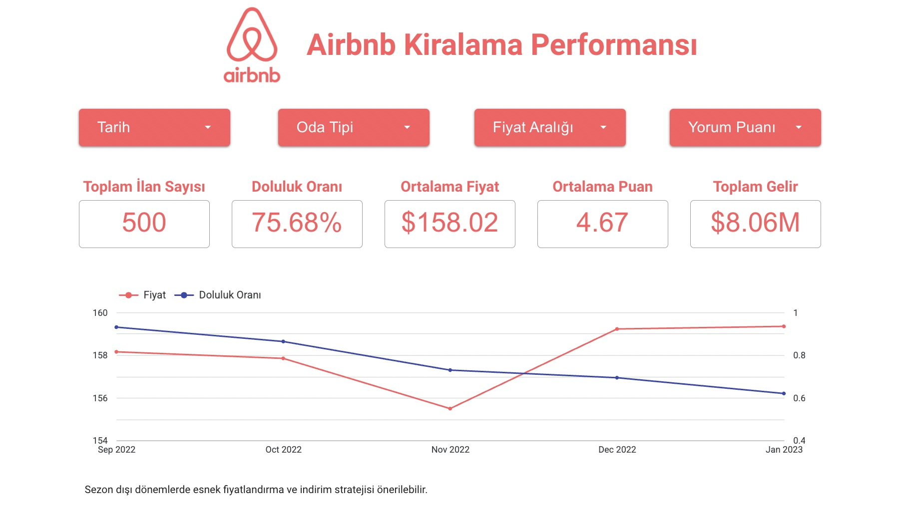
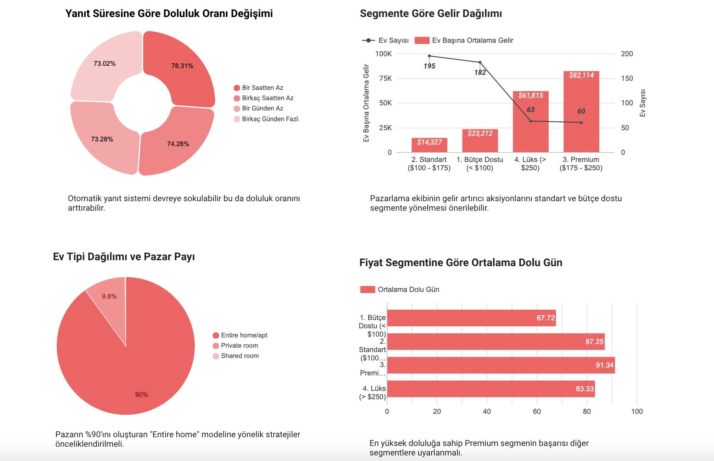
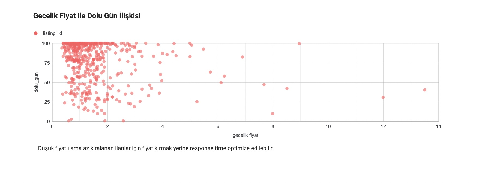

# Airbnb Listing Performance Analysis

### Data Analytics Project | Google BigQuery & Looker Studio

## Project Overview

This project explores Airbnb listing performance
through data analysis and interactive visualization.

The main objective is to investigate how pricing,
availability, customer ratings, and host responsiveness
relate to listing performance.

The project uses Google BigQuery for data analysis
and Looker Studio to present the results through
an interactive dashboard.

## Business Objectives

The analysis focuses on four key questions:

1. How does pricing relate to listing availability
   and estimated occupancy?
2. What is the relationship between customer ratings
   and listing performance?
3. How does host responsiveness relate to listing
   performance?
4. What characteristics are associated with
   high-performing Airbnb listings?

## Tools & Technologies

- **Google BigQuery:** Data analysis and processing
- **SQL:** Data exploration and analysis
- **Looker Studio:** Interactive dashboard development
  and data visualization

## Interactive Dashboard

Explore the interactive dashboard:

[View Airbnb Performance Dashboard](https://datastudio.google.com/s/tacWgCMbJmE)

## Analysis Focus

- Pricing analysis
- Availability and estimated occupancy
- Customer review scores
- Host responsiveness
- Listing performance comparisons

## Key Findings & Business Recommendations

### Key Findings

- The dashboard covers 500 Airbnb listings, with a 75.68% occupancy rate, an average price of $158.02, an average review score of 4.67, and reported total revenue of $8.06M.
- Hosts responding within one hour have a 78.31% occupancy rate, compared with 73.02% for hosts taking several days to respond.
- Premium listings ($175–$250) record an average of 91.34 occupied days, compared with 67.72 days for budget listings (under $100).
- Entire homes and apartments represent approximately 90% of the property-type distribution shown in the dashboard.

### Business Recommendations

- Explore automated messaging and faster host response workflows to support guest communication.
- Investigate the characteristics of premium listings to identify practices that may be relevant to other pricing segments.
- Test seasonal pricing strategies using occupancy and revenue metrics to evaluate their effectiveness.

These findings describe associations within the analyzed dataset and do not establish causal relationships.

## Dashboard Screenshots

### 1. Dashboard Overview

Overview of key performance indicators, including total
listings, occupancy rate, average price, average review
score, total revenue, and monthly performance trends.

### 2. Segment & Host Performance Analysis

Analysis of host response times, revenue distribution
across pricing segments, property types, and average
occupied days.

### 3. Price & Occupancy Analysis

Visualization of the relationship between nightly
pricing and occupied days across Airbnb listings.

